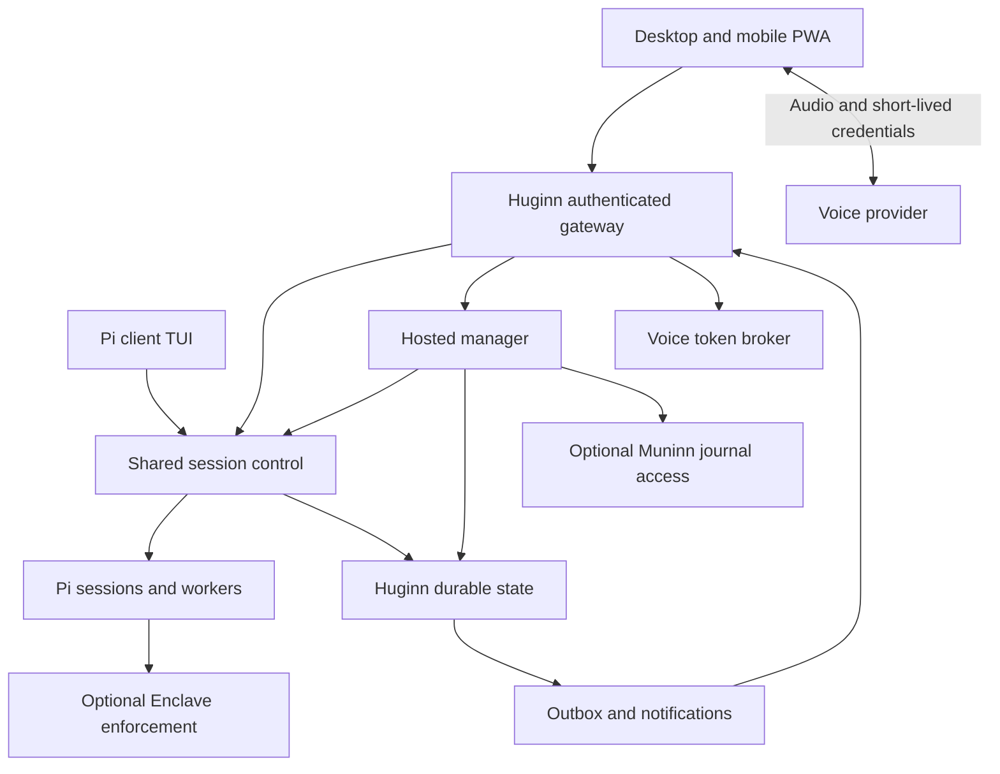

# Architecture proposal

Reviewed September 5, 2026. Everything described as a Huginn service or behavior below is
proposed. Existing upstream and sibling capabilities, source references, and unresolved
integration gaps are recorded in the [upstream assessment](upstream-2026-09-05.md).

## Deployment and ownership

The default deployment has one always-on host and thin clients. The host runs the manager,
stores its credentials, and owns its state. Browser-hosted managers and browser-held provider
keys are not part of the initial architecture.



The gateway, manager, token broker, and notification service may initially share a daemon
process. Pi owns session workers and their execution lifetime. Logical separation of roles
does not imply credential isolation between code running in the same process. Host process
or user separation can be added when an operator needs that boundary.

| State | Authority | Client role |
| --- | --- | --- |
| Session history, agent operations, execution results | Pi's durable session/runtime | Render a bounded projection |
| Manager conversations and pending investigations | Huginn host store | Select a conversation and send input |
| Command admission, receipts, device control, announcements | Huginn host store | Submit identified requests; render/acknowledge delivery |
| Effective execution policy and Enclave approvals/audit | Enclave, when selected | Display the effective policy and exact decision request |
| Historical project journal and its trust/correction labels | Muninn, when enabled | Explicit search and read |
| Offline drafts, cached snapshots, audio capture/playback | Client | Local convenience; never execution authority |

Huginn uses a local transactional store, initially SQLite, for operational records and an
outbox. It references pi's durable IDs rather than copying full transcripts into a second
session store. Digests are derived caches with provenance, source revision, and update time.
The source outcomes, command receipts, and delivery records needed for recovery are durable.

Host state and credentials live under the selected pi agent directory, outside project
checkouts, with owner-only permissions. An enabled Enclave profile must protect those paths
from worker tools. Filesystem permissions alone do not isolate unsandboxed tools running as
the same user. Audio is not retained by default. The operator can set conversation and
snapshot-cache retention independently of pi's session history and Muninn's journal.

## Pi integration

The starting point is pi v0.85.0's routed protocol v8, Chord service bindings, durable
sessions, and experimental client TUI. Huginn adapts application services; it does not
revive the earlier proposal's v1/v2 protocol or implement another transcript reducer.

Milestone 0 must establish a supported composition path for the host, worker services, TUI,
and required extension hooks. A file in pi's source tree is not automatically a supported
package export. In particular, compatibility between the experimental service runtime and
the extension APIs Enclave and Muninn use is a testable question, not an assumption.

Huginn-specific receipts, control policy, approvals, and bounded presentation views belong
at the application service boundary. They must apply to **every** attached presentation,
including the TUI and manager; a browser-only guard cannot coordinate the other clients.
Reuse existing operation IDs, service hydration, sequencing, and cancellation wherever
possible. Put a missing shared guard in the common host/worker path, with a small upstream
patch if needed.

The fork `frycm/pi` remains based on a stable release. Upgrade its supported baseline by
assessing each release and passing compatibility gates before moving the pin. Keep patches
small, submit generally useful changes upstream, and remove them once released. Do not
promise compatibility with untested newer versions.

## Commands, outcomes, and recovery

Every externally admitted mutation has a client-generated idempotency key. Its receipt binds
the authenticated actor, server, session or project target, command kind, and payload hash.
Creation and project-level changes need receipts too; deduplication cannot be per-session
only when the command creates that session. Reusing a key with different input is an error.

The host persists admission before dispatch and records the upstream operation ID when
available. A repeated request returns the stored receipt **before** considering a newer
revision; a lost response must not turn an accepted command into a fresh draft to resend.
If the process dies between admission and a recoverable upstream acknowledgement, the host
reconciles against pi's durable operation records. Where that cannot establish execution,
the receipt becomes `unknown`; it is not automatically dispatched again.

Product-facing records use stable identities:

| Record | Required meaning |
| --- | --- |
| Command receipt | Accepted, rejected, dispatched, completed, or unknown; upstream operation reference and reason |
| Run | Durable run/operation ID; queued, running, waiting for decision, succeeded, failed, cancelled, interrupted, or unknown |
| Investigation ticket | Original question, requester/conversation, target workspace and source item, run ID, deadline, budget, result references |
| Decision request | Issuer, session/run, stable request ID, exact action or question, expiry, current resolution |
| Announcement | Stable cause ID, content version, priority, supersession, and per-channel delivery state |

These are Huginn application concepts to map onto actual pi and Enclave states, not a new
wire protocol. `Idle` is an execution phase, not proof of success. A failed test result is
evidence distinct from a successful agent turn. The manager separates observed outcomes,
the agent's claims, and its own interpretation, and links the source evidence on screen.

Snapshots hydrate the current view; pi/Chord owns stream sequencing and gap detection.
Notifications are derived from durable run outcomes and decision records, never merely
from a revision advancing while a session is idle. Rebuilds must converge without inventing
completions or losing outstanding investigations.

Outstanding decisions are part of the hydrated session view and belong to their issuing
runtime, not the connection that first displayed them. Resolve an exact request atomically;
a second response is stale, and every client sees the resolution. Expiry and cancellation
follow the issuer's contract. After restart, reconcile with the issuer before re-enabling
a cached decision card: a persisted display record cannot revive a vanished callback or
authorize a different action. Persistent extension UI values also belong in the current
view; transient notifications do not replace decision state.

On host restart, reconcile active runs, decisions, control leases, and dispatch receipts
before permitting new work in the affected checkout. An upstream operation may resume only
according to its verified recovery contract; arbitrary tool side effects cannot be assumed
safe to repeat. Persist unknown outcomes until reconciled or explicitly resolved by the user.
Stop requests remain available during recovery when a live operation can be identified.

Receipt retention covers the documented retry horizon and survives restart. After detailed
results expire, retain a bounded tombstone for the key within that horizon. Requests older
than the supported horizon are rejected for reconciliation, never accepted as new work.
Document limits and cleanup before release; do not rely on the former ten-minute memory cache.

## Human control and delegated work

Authentication identifies the operator and device. The host separately identifies direct
human input, manager-generated delegation, and execution evidence. An authenticated manager
connection does not make its generated text a direct user instruction.

Record the user's original text separately from a derived instruction, along with the
selected project/session and the delegation that authorized it. Preserve that distinction
through the pi/Enclave adapter. Do not send manager prose through a path that labels all RPC
messages as direct human authorization. If the runtime cannot preserve this distinction,
autonomous manager integration with Enclave remains unavailable until the adapter is fixed.
Direct user controls and standalone operation can still be delivered independently.

Controls follow these rules:

- Any authenticated device can observe. A device can explicitly take control of a run even
  while its previous controller remains connected. Takeover atomically advances a control
  generation and is visible on all clients; delayed commands from the previous generation
  cannot steer the run.
- Manager actions stay within the user's delegated task and current control generation.
  They cannot silently take control back after a human takeover. Resolving an ambiguous
  session target requires clarification; it does not guess from a stale conversation.
- Stop targets a particular active operation and is idempotent. It bypasses manager and
  voice-model inference and does not depend on a transcript revision or control lease.
  It must not cancel a later operation that happens to occupy the same session.
- Preconditions are operation-specific: steering checks the active run and control
  generation; decisions check the exact pending request; configuration changes check the
  applicable configuration version. Streaming text does not invalidate an emergency stop.
- User input received offline stays a draft. Reconnect first queries receipts for requests
  that may already have been sent; genuinely unsent drafts require an explicit send against
  current state. Neither client nor service worker automatically replays mutations.

Direct controls remain available during manager outages, exhausted manager budgets, or voice
failures. Routine actions inside an existing delegation do not require another confirmation
merely because the instruction passed through the manager.

## Enclave: one boundary format, optional enforcement

**Strongly recommend pi-enclave for unattended sessions and auto mode.** Huginn is the
remote control and supervision surface; Enclave owns sandbox compilation, deterministic
rules, its isolated reviewer, action binding, human escalation, and the audit log.

Users define execution boundaries in Enclave's format and existing configuration sources:

| Source | Role |
| --- | --- |
| `<agent-dir>/enclave.json` | User-owned profiles, sandbox settings, rules, reviewer, and attendance |
| `.pi/enclave.local.json` | Enclave's permitted local project restrictions/profile selection |
| `.pi/enclave.json` | Enclave's permitted shared project restrictions, subject to project trust |

Enclave's parser and configuration fold are authoritative, including its ordering of
built-in, user-global, environment, project-local, and project-shared settings. Project
sources cannot relax the user's boundary. Deterministic `sandbox.*` and `rules.*` controls
remain distinct from the model-interpreted `review.*` rulebook. Huginn must not translate
these into a second permissions file or treat prose rules as OS enforcement.

The initial UI shows Enclave availability, selected profile, effective restrictions and
their sources, backend health, attendance, pending decisions, and failure reasons. Policy
setup links to Enclave's own tooling. Any later editor must validate through Enclave and
preserve its configuration-source rules; models cannot change policy through a manager tool.
An installed package alone is not evidence that enforcement is active in a particular worker.

Two explicit execution configurations are supported:

- **Standalone pi:** all core remote, manager, and investigation flows work with the tools
  and execution behavior configured in pi. Existing extension decision prompts can be
  surfaced where supported. Huginn adds no blanket per-tool permission scheme and claims
  no Enclave sandbox guarantee. The interface plainly identifies the effective configuration.
- **Pi with Enclave:** the user selects an existing valid Enclave profile. Enclave makes
  the execution decisions; its configured auto mode may permit work without asking the
  operator. An Enclave denial stays denied, and an Enclave `ask` remains a human decision.
  Failure or incompatibility of a selected Enclave integration blocks affected execution;
  it never changes that session into standalone mode automatically.

The host's approval bridge is separate from manager tools. A human decision binds the issuer,
request ID, canonical action, session, expiry, and authenticated device. The manager can
explain a pending decision and open its card, but cannot fabricate the human confirmation,
answer an attendance challenge, or override Enclave. Initially, voice can navigate to an
approval card; a generic spoken “approve” is not an authenticated Enclave decision channel.
A later voice approval path needs its own verified binding and ambiguity handling.

**Current integration limit:** Enclave's existing attendance handshake uses legacy pi RPC
UI requests. It authenticates an approval channel, not each response. The secret stays in
the host approval bridge, outside model contexts and browser storage; the bridge must only
assert attendance while an explicitly opted-in human approval surface is present and must
propagate loss of that surface. A persistent manager connection is not attendance.
Compatibility with Chord services and dynamic device handoff must be demonstrated first.

Persisted unattended actions currently have a terminal-only `pi-enclave approve <nonce>`
path; there is no supported remote approval API. Until Enclave supplies and verifies one,
Huginn can report that work needs a host-side decision but cannot promise phone approval of
those records. It must not edit private pending files, invoke approval through model tools,
or simulate terminal confirmation. Expiry, policy revalidation, and execute-once semantics
remain Enclave's responsibility. This gap gates the remote Enclave approval feature, not
standalone Huginn.

## Muninn: historical evidence on demand

Muninn is an optional journal integration, not Huginn's manager memory database or event
queue. Current session state and current code remain the source for “what is happening.”
The manager explicitly uses `journal_search`, `journal_read`, and `journal_context` when a
question benefits from earlier decisions or outcomes. Preserve stable record references,
source/trust labels, observations, corrections, and conflicts in the answer. Retrieval is
bounded and does not automatically inject journal content into every conversation.

Load Muninn in a compatible session runtime for its ordinary lifecycle capture. A remote
RPC session already uses that capture path; do not append a second copy of every outcome.
For additional Huginn-specific evidence, such as a remote handoff, use Muninn's existing
`muninn-integration-v1` custom-entry contract or `muninn ingest` JSON/JSONL interface with
provider `pi-huginn`. Select one producer path per observation. Keep a stable external ID;
Muninn deduplicates `(provider, external_id)` and rejects changed input under the same key.

Integration observations are always `source: "external"`. They cannot mint user
corrections or authority. Manager-written notes are agent-authored. An actual user correction
must use Muninn's supported attended/user boundary. Do not write its journal files, registry,
index, or trust pins directly. Export only bounded, redacted observations, not full
transcripts, prompts, tool arguments, credentials, or audio. Journal synchronization remains
the operator's explicit Muninn configuration, never an automatic consequence of pairing a phone.

When Muninn is unavailable, disable historical retrieval and retain a bounded export outbox
if the operator enabled capture. Surface an export failure without blocking session work.
This outbox contains no live execution authority. The current Muninn pi-version range and
runtime compatibility must be resolved before advertising the in-process integration.

## Projects, workspaces, and investigations

A project is a durable logical identity. A checkout/worktree is a place where work runs;
`cwd`, branch, and commit are provenance rather than project identity. When Muninn is enabled,
use its supported project resolver and user-owned registry mapping. Huginn keeps a local
project ID without Muninn and an explicit mapping to a Muninn UUID when linked; adding or
removing the integration never rewrites existing session/receipt identities. Never infer
shared identity solely from matching code-remote URLs or a repository-controlled manifest.

Session creation resolves an operator-registered workspace and applies pi's host-side
project trust decision before importing project code. Selecting a directory on a phone or
through the manager is not itself a trust grant. An unresolved trust decision is surfaced
through a supported human setup/decision path, with affected creation blocked until resolved.
Preserve this gate in standalone and Enclave configurations; tool policy does not substitute
for trust in extensions that execute inside pi's own process.

In the first release, the common host guard admits at most one active writing run per
canonical checkout, including direct TUI runs and manager-created runs. Independent worktrees
may later allow parallel writing. This guard coordinates managed pi runs, not arbitrary
external editors and processes; their changes remain observable workspace changes.

An investigation has an explicit question and a bounded read-only tool surface. Without
Enclave this is a restricted tool configuration, not a kernel sandbox claim. With Enclave,
use a compatible user-defined profile that enforces the intended restriction and verify it
in that worker. Do not load arbitrary executable project extensions into a supposedly
read-only investigation. Approved declarative project guidance can be supplied as context;
it is not execution authority. A required unavailable tool yields a limitation or a proposal
for normal working-session execution, never an implicit escalation.

Conversation forks and workspace snapshots are separate choices:

- A live investigation reads the current checkout. Record start/end times, HEAD, dirty
  state and relevant file identities; mark that files may change during reading. Unchanged
  HEAD alone is not evidence of an unchanged dirty checkout.
- A reproducible investigation uses a captured workspace with an explicit snapshot ID,
  including a declared treatment of dirty and untracked files. Capture must establish a
  consistent view or fail; never label a best-effort directory copy immutable evidence.
- Forking conversation at an item does not restore files from that point. The ticket names
  both the source item and the actual workspace observed. Historical code requires an
  explicit captured revision; unavailable historical dirty state is reported as unavailable.

Start with clearly labelled live investigations and a small concurrency limit. Archive
ephemeral investigation sessions only after their answer and evidence references are retained;
the outcome remains accessible from the ticket. Cancellation, deadlines, and budget
exhaustion produce explicit outcomes and release resources.

## PWA, connectivity, and authentication

Use Vite and Preact for the PWA and the browser-safe pi client/service bindings where the
baseline supports them. The core views are an attention inbox, projects/sessions, a bounded
transcript with source evidence and diffs, a composer, the hosted manager conversation, and
settings. A persistent direct stop control names the selected session/run. The attention
inbox prioritizes decisions and failures; ordinary completions can be grouped or muted.

Use Tailscale Serve in front of a loopback-bound daemon for the first deployment. Bindings,
configured public origin, and trusted proxy addresses are explicit. Authorize the operator
from verified Tailscale identity; accept forwarded identity headers only from the configured
trusted proxy, never arbitrary peers. Reject cross-origin WebSocket upgrades before session
access. Apply authentication and appropriate same-origin/CSRF checks to HTTP mutations,
approval responses, notification subscriptions, and the voice token broker too.

WebSockets carry bounded binary protocol frames, with backpressure and queue limits. Reconnect
uses backoff, establishes a fresh attachment route, and hydrates services before enabling
state-dependent commands. Reject unsupported service/protocol versions with an actionable
compatibility error. PWA asset updates must not leave an old cached client silently issuing
mutations against incompatible host services.

Every presentation path needs a byte budget: initial transcript tail, updates, history pages,
tool parts, file/diff reads, and attachments. Reuse upstream controls where sufficient, and
add bounded application projections where not. Initial targets are a 1 MiB snapshot tail,
256 KiB inline content parts and 4 MiB history/range responses, with an encoded message ceiling
below the peer's configured frame limit. Preserve truncation metadata and continuation.
These are proposed application limits, not existing protocol v8 fields. Add no ad hoc raw
byte content fields to v8's strict-JSON service payloads; image transport is a later design.
File reads resolve within approved workspace roots with symlink-aware checks and size caps.

The service worker caches the shell; cached session state is visibly timestamped and stale
when disconnected. Cache purge/logout is available on a shared device. Provider credentials
and approval secrets are never persisted by clients. Notifications are sent by the host,
not a browser-resident manager. Configure opt-in Web Push, quiet hours, and low-detail lock
screen payloads; notification delivery does not prove that the operator read a message.
iOS push requires an installed Home Screen web app and user permission, as documented by
[WebKit](https://webkit.org/blog/13878/web-push-for-web-apps-on-ios-and-ipados/).

Device-key pairing is later and supplements authentication without changing reachability.
Keep its bootstrap on HTTPS, validate nonce/host/expiry, and issue an HttpOnly session cookie.
Revoking a device must close existing sockets and invalidate sessions, not merely fail its
next upgrade. A device authorized separately by Tailscale remains subject to that separate
policy; show the effective authentication source. Plain HTTP LAN deployment, public relays,
and generalized proxy configurations are outside the first release.

## Manager, notifications, and voice

One hosted manager serves multiple durable conversations and sessions. Conversations have
stable IDs so another device can continue one deliberately; devices do not automatically
combine unrelated conversations. It maintains compact attributable digests, fetches details
only when necessary, and returns investigation tickets immediately. Status facts can be
rendered from host state without calling a model. Requests for an explanation may use one.

Keep the manager model selectable and BYOK, using pi's provider abstraction where suitable.
Cloud providers and compatible local/open-weight endpoints are intended options; qualify
one initial combination before expanding support. A local text setup must not require a
voice vendor or cloud manager. Coding, manager, reviewer, and voice model choices are separate.

The manager has narrow tools for status, bounded evidence reads, delegated prompt/steer,
investigations, and optional journal retrieval. It has no general host shell, credential
access, policy editor, or human-approval tool. The runtime dispatcher checks delegation,
target and budgets outside model text. Pi tools and any Enclave enforcement still execute
the actual work. Provider failure leaves direct controls and observable session state intact.

The host stores announcements under stable cause IDs such as a run ID or issuer/request ID.
An atomic outbox makes completion/decision recording and announcement scheduling consistent.
All devices share pending/read/dismissed state. A playback lease chooses one active voice
surface; explicit handoff or lease expiry allows another device to deliver. Pending approval
cards are independently visible wherever attached and resolve everywhere when answered.

Delivery is retriable and deduplicated by announcement ID. Network loss at acknowledgement
time can still repeat a notification; do not promise exactly-once human delivery. Distinguish
sent, displayed, playback-completed, and user-acknowledged states. Playback completion is not
proof someone heard the message. Resolved decisions and newer summaries supersede older
announcements; configured retention expires delivery records without deleting source outcomes.

Voice is an adapter over the same hosted manager. Start with one provider after a mobile
capability spike; OpenAI Realtime is the first candidate. Keep provider identifiers, pricing,
token lifetimes, announcement behavior, and compatibility evidence in an implementation-time
provider record instead of embedding a stale survey in the vision.

The host holds long-lived keys and brokers short-lived browser credentials. Where supported,
the browser exchanges audio directly with the provider and forwards tool intents to the host;
all state-changing tool calls are executed through the host dispatcher. The voice provider
gets conversational audio and speech-ready responses, not raw session subscriptions. The
manager provider may receive bounded session content necessary to answer the user. BYOK
does not imply that those providers are local or that no session-derived data leaves the host.

Speech output uses a narrow projection and redaction controls. Model instructions alone
cannot guarantee that generated summaries contain no secrets; strict deployments restrict
spoken content to structured status/templates or disable external voice. Raw code, command
payloads, and detailed approval actions remain on screen by default. Local voice is a later
adapter, not a promised property of browser speech APIs.

Audio is initially foreground-only on supported mobile clients. Suspending audio does not
stop host work or lose announcements. Deliver speech at pauses with a defined interruption
policy. Distinguish “stop speaking” from “stop this coding run”; the direct run-stop control
works without a functioning voice provider.

## Resource limits and operations

Configure per-task and daily spending limits, maximum active runs/investigations, tool/model
turn limits, investigation deadlines, and announcement rates. Count manager, coding,
investigation, and voice usage together where available. Show estimated versus reported
cost, and unknown pricing explicitly. Reserve estimated cost before dispatch; actual provider
billing can lag or differ, so a dollar budget is an admission limit with stated overshoot,
not a claim of exact billing enforcement. Enclave reviewer usage also contributes when its
integration exposes it. Exhaustion pauses new work and preserves direct stop/recovery controls.

Ship one documented host setup with systemd/launchd lifecycle support, startup diagnostics,
and a doctor command for connectivity, TLS, pi compatibility, selected extensions, provider
availability, and store health. Show failures with their source and recovery action. Keep
the daemon alive independently of the terminal and define graceful shutdown/restart behavior.

Back up Huginn's operational store consistently with the pi session references it depends on;
keep Enclave policy/secrets and Muninn stores in their own documented backup workflows. Schema
upgrades require an explicit version, backup, compatibility check, and tested restore path.
Model-free observation and session controls that do not require a model remain available
when model credentials are missing. Unsupported features are visible capabilities, not
requests that mysteriously hang.

## Code organization

Proposed layout, to create only as the corresponding slices are implemented:

```text
host/          # authenticated gateway, lifecycle, store, receipts, notification outbox
pi/            # adapter to pinned pi services and shared host/worker controls
manager/       # hosted conversations, digests, delegation, investigation orchestration
integrations/  # optional enclave and muninn adapters
voice/         # token broker and provider adapters
web/           # thin PWA, no authoritative manager or provider keys
extension/     # thin TUI setup/status affordances where the runtime supports them
shared/        # versioned application DTOs and capability descriptions
```

The proposed `huginn` CLI manages setup/start/stop/status/doctor; a thin `/huginn` pi extension
may expose appropriate equivalents. These commands do not exist yet. Do not invent pi core
subcommands as a shortcut around its actual CLI registration and extension contracts.
